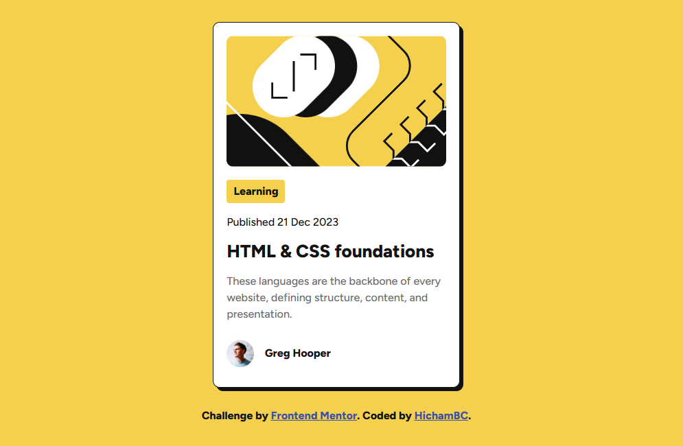

# Frontend Mentor - Blog preview card solution

This is a solution to the [Blog preview card challenge on Frontend Mentor](https://www.frontendmentor.io/challenges/blog-preview-card-ckPaj01IcS). 

## Table of contents

- [Overview](#overview)
  - [The challenge](#the-challenge)
  - [Screenshot](#screenshot)
  - [Links](#links)
- [My process](#my-process)
  - [Built with](#built-with)
  - [What I learned](#what-i-learned)
  - [Useful resources](#useful-resources)
- [Author](#author)

## Overview

### The challenge

Users should be able to:

- See hover and focus states for all interactive elements on the page

### Screenshot



### Links

- Solution URL: [blog preview card solution](https://github.com/Hicham-BC/blog-preview-card-main)
- Live Site URL: [Website](https://hicham-bc.github.io/blog-preview-card-main/)

## My process

### Built with

- Semantic HTML5 markup
- CSS custom properties
- Flexbox

### What I learned

i learned how important is a responsive layout to a webiste and for that i learned to make my fonts, spacing and container sizes be fluid with the width of the viewport. i also learned how to use integrated font files in the project especially variable fonts.

```css
@font-face {
  font-family: "Figtree";
  src: url(assets/fonts/Figtree-VariableFont_wght.ttf) format("truetype-variations");
  font-weight: 300 900;
  font-style: normal;
}
```

### Useful resources

- [Medium](https://medium.com/@zmactavish/use-custom-fonts-with-css-b316781ef916) - This helped me know how to implement and embed custom fonts on css. I really liked this method and will use it going forward.

## Author

<!-- - Website - [Add your name here](https://www.your-site.com) -->
- Frontend Mentor - [@Hicham-BC](https://www.frontendmentor.io/profile/Hicham-BC)